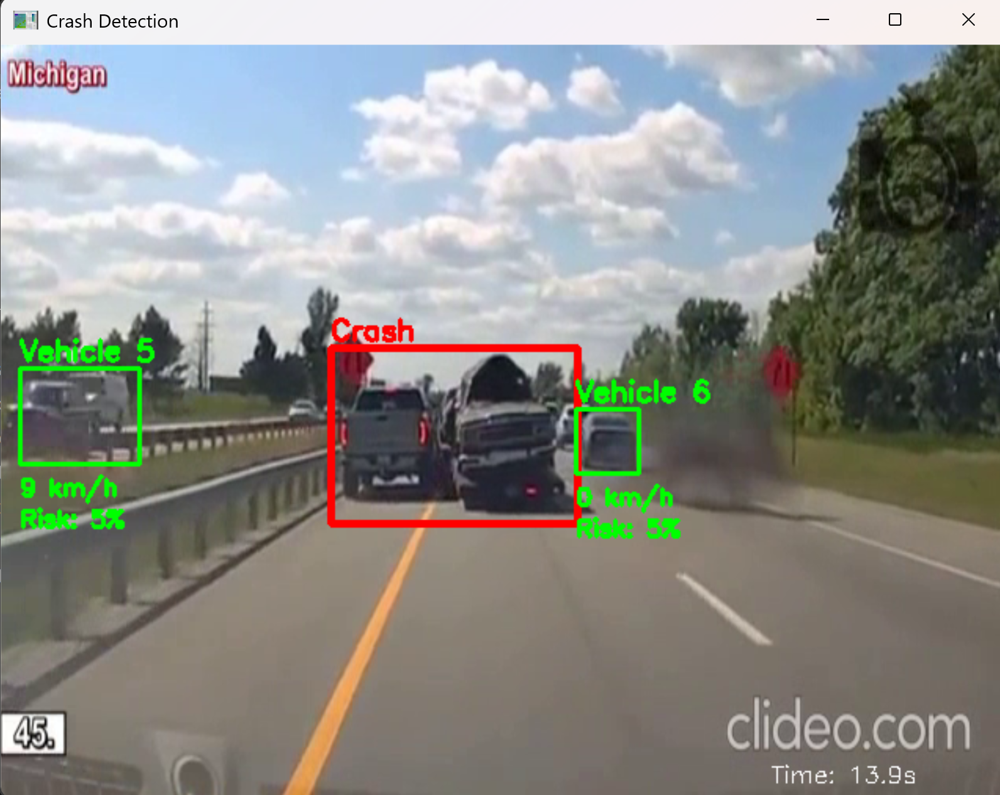
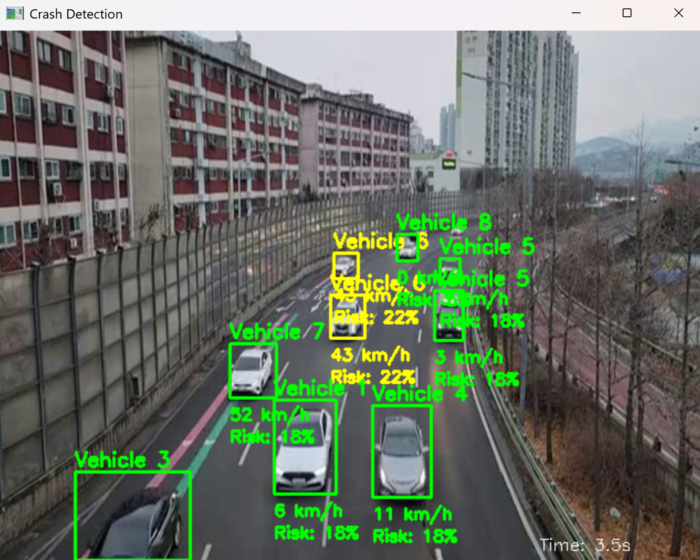
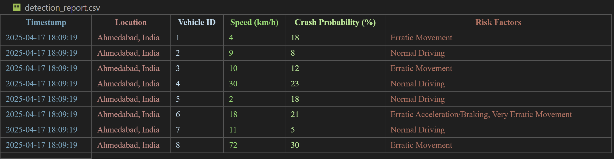
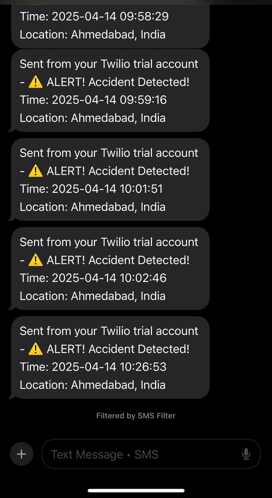
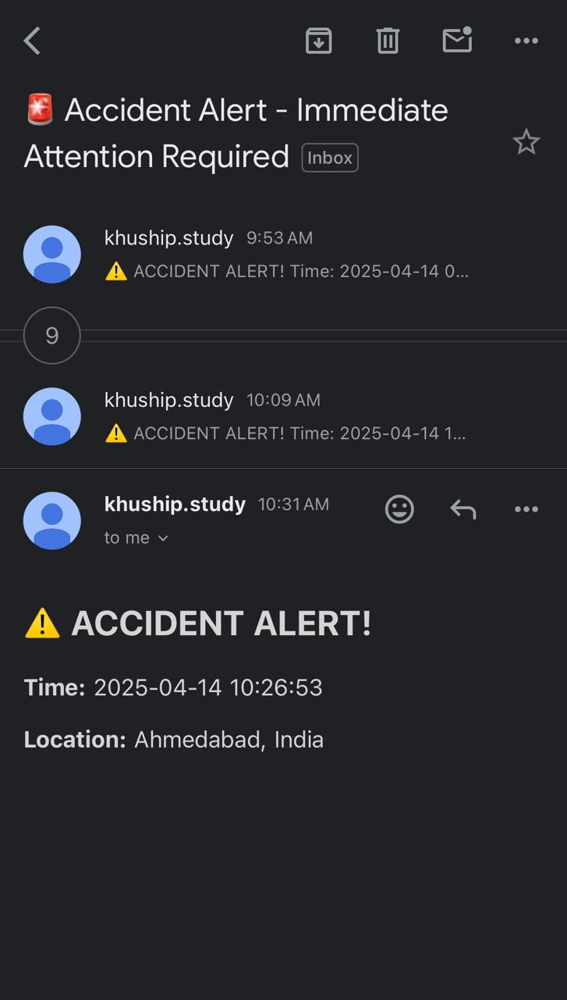

<div align="center">

# 🚗 Car Crash Detection & Risk Analysis System


A real-time Computer Vision system that detects car crashes, estimates vehicle speed, analyzes crash risk levels, sends emergency SOS alerts, and generates comprehensive reports. The system utilizes advanced object detection techniques with YOLOv8, specifically leveraging both YOLOv8n and YOLOv8m models. Depending on the scenario, weights from either model are used to balance speed and accuracy — with YOLOv8n optimized for faster inference and YOLOv8m for improved detection precision. Through this combined approach, the system achieves an overall detection accuracy of approximately 60%, providing dynamic visual feedback using bounding box color changes based on risk probability.

</div>

---

## ⚙️ Features

| Feature | Description |
|---|---|
| 🚨 Crash Detection | Real-time detection of vehicle crashes using YOLOv8 |
| 🚗 Speed Estimation | Estimates vehicle speed from frame-to-frame displacement |
| 📊 Risk Analysis | Classifies crash risk as Low / Medium / High based on motion vectors |
| 📧 SOS Alerts | Automatically sends emergency alerts via Email/SMS on high-risk events |
| 📝 Report Generation | Generates comprehensive crash reports with timestamps and metadata |
| 🎨 Visual Feedback | Bounding box color changes dynamically based on risk probability |

---

## 🛠️ Tech Stack
```
Object Detection  → YOLOv8n + YOLOv8m (Ultralytics)
Computer Vision   → OpenCV
Backend           → Python 3.x
Dashboard         → Streamlit
Alerts            → SMTP (Email) / Twilio (SMS)
Report Generation → FPDF / ReportLab
```

---
🖼️ Screenshots & Demo
Car Crash Detection in Action
Here is a screenshot of the car crash detection in action:








## 📁 Project Structure
```
car-crash-detection/
│
├── models/
│   ├── yolov8n.pt          # Nano model (fast inference)
│   └── yolov8m.pt          # Medium model (higher accuracy)
│
├── src/
│   ├── detector.py         # Core crash detection logic
│   ├── speed_estimator.py  # Vehicle speed estimation
│   ├── risk_analyzer.py    # Risk classification module
│   ├── alert_system.py     # SOS email/SMS alerts
│   └── report_generator.py # PDF report generation
│
├── dashboard/
│   └── app.py              # Streamlit dashboard
│
├── data/
│   └── sample_videos/      # Test video inputs
│
├── requirements.txt
└── README.md
```

---

## 🚀 Getting Started

### 1. Clone the repository
```bash
git clone https://github.com/Khushipatel27/car-crash-detection.git
cd car-crash-detection
```

### 2. Install dependencies
```bash
pip install -r requirements.txt
```

### 3. Run the Streamlit app
```bash
streamlit run dashboard/app.py
```

### 4. Dataset Link
```bash
https://drive.google.com/drive/folders/1Posjr0TfdnQ7f6Zy8hWgIrHtvBZWzWEc?usp=sharing
```
---

## 📈 Model Performance

| Model | Inference Speed | Detection Precision | Use Case |
|---|---|---|---|
| YOLOv8n | Fast (~30ms) | ~55% | Real-time / Live feed |
| YOLOv8m | Moderate (~70ms) | ~65% | Recorded video analysis |
| **Combined** | Adaptive | **~60%** | **Default system mode** |

---

## 🔴 Risk Level Classification

| Risk Level | Bounding Box Color | Trigger Condition |
|---|---|---|
| 🟢 Low | Green | Normal vehicle motion |
| 🟡 Medium | Yellow | Sudden deceleration / near-miss |
| 🔴 High | Red | Collision detected → SOS triggered |

---

## 🔔 SOS Alert System

On detection of a **High Risk** event, the system automatically:
- Captures a snapshot of the crash frame
- Sends an **email alert** with the snapshot and crash metadata
- Logs the event with timestamp, location, and risk score

---

## 🧰 Requirements
```
ultralytics
opencv-python
streamlit
smtplib
fpdf
numpy
```

---

## 👩‍💻 Author

**Khushi Patel**  
MS Applied Data Science, USC Viterbi  
[GitHub](https://github.com/Khushipatel27) • [LinkedIn](https://linkedin.com/in/khushi-patel)

---

> Built as part of an ML Engineering internship at Techsture Technologies — achieving a **21% accuracy improvement** over the baseline model through model selection and ensemble strategy.


