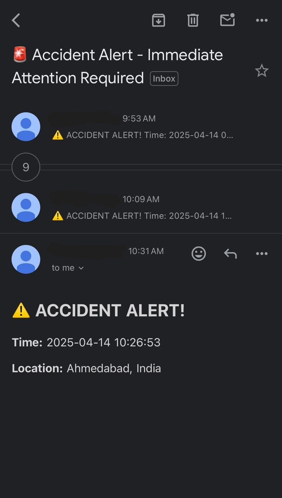

# 🚗 Car Crash Detection & Risk Analysis System

A real-time Computer Vision system that detects car crashes, estimates vehicle speed, analyzes crash risk levels, sends emergency SOS alerts, and generates comprehensive reports. The system utilizes advanced object detection techniques with YOLOv8, specifically leveraging both YOLOv8n and YOLOv8m models. Depending on the scenario, weights from either model are used to balance speed and accuracy — with YOLOv8n optimized for faster inference and YOLOv8m for improved detection precision. Through this combined approach, the system achieves an overall detection accuracy of approximately 60%, providing dynamic visual feedback using bounding box color changes based on risk probability.

---

## 🧠 Key Features

- 🔍 **Car Crash Detection**  
  Detects collisions in real-time using YOLO-based object detection on video feeds or uploaded videos.

- 🛣️ **Vehicle Speed Estimation**  
  Estimates the speed of detected vehicles frame-by-frame.

- ⚠️ **Crash Risk Analysis**  
  Calculates the probability of a crash occurring and updates bounding box colors:
  - 🟩 **Green** – Low Risk  
  - 🟨 **Yellow** – Moderate Risk  
  - 🟥 **Red** – High Risk  

- 🧠 **Advanced Crash Risk Assessment**  
  **Proactive Monitoring Before Accidents Occur:**
  - **Speed Estimation:** Calculated using real-world calibration and frame displacement analysis.  
  - **Risk Factors Considered:**  
    - Vehicle speed and acceleration  
    - Proximity to other vehicles  
    - Erratic movements and sudden braking  
  - **Visual Risk Indicators:** Bounding boxes colored based on risk levels (%) for intuitive visual feedback.

- 🆘 **SOS Emergency Alert System**  
  Automatically sends SOS alerts with crash data (e.g., time, location, risk level) to emergency contacts when a high-risk crash is detected.

- 📊 **Comprehensive Reporting System**  
  **Automated Report Generation (CSV Format):**
  - Unique vehicle tracking with consistent IDs  
  - Recorded maximum speed per vehicle  
  - Estimated crash probability percentages  
  - Key risk factor annotations  
  - Accident timestamps and location logs

- 🎥 **Video Input Support**  
  Accepts video files or live camera feeds for analysis.

---
🖼️ Screenshots & Demo
Car Crash Detection in Action
Here is a screenshot of the car crash detection in action:




## 🛠️ Tech Stack

- **YOLOv8** – Object detection for car and crash detection  
- **OpenCV** – Video processing and visualization  
- **Python** – Backend logic and report generation  
- **Pandas** – Data handling and analytics  
- **Matplotlib / Seaborn** – Graphs  
- **SMTP / Twilio API** – For SOS alerts via email/SMS  

---
## 📁 Project Structure

```bash
├── Runs/                          # YOLO training outputs
├── MEDIUM/                        # YOLOV8M trained output
├── NONO/                          # YOLOV8N trained output
├── train/                         # YOLOv8 training notebooks
│   ├── yolov8m_train.ipynb        
│   ├── yolov8m_2_train.ipynb      
│   └── yolov8n_train.IPYNB        
├── video_final/                   # Sample crash videos
│   ├── Crash_1.mp4
│   ├── Crash_2.mp4
│   └── ...
├── detection_report.csv           # Auto-generated report
├── output_crash_detection.mp4     # Final processed video with bounding boxes
├── main.ipynb                     # Main code for detection and analysis
├── .gitignore                     # Git ignore config
└── requirements.txt               # Dependencies 

How to Run
1. Clone the Repository
git clone https://github.com/khushipatel27/car-crash-detection.git
cd car-crash-detection

2. Install Dependencies Make sure you have Python installed. Then run:
pip install -r requirements.txt

3.Run the Main Script Launch the detection system:
jupyter notebook main.ipynb

4. Dataset Link
https://drive.google.com/drive/folders/1Posjr0TfdnQ7f6Zy8hWgIrHtvBZWzWEc?usp=sharing

